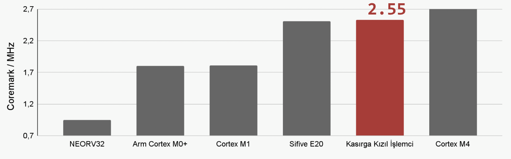

# tekno-kizil

## KASIRGA - KIZIL Takımı Teknofest 2023 Yonga Tasarımı

**TEKNOFEST 2023 Çip Tasarım Yarışması Sayısal İşlemci Kategorisi Birincisi**

<p align="center">  </p>

**KIZIL İşlemci Projesi**

**Danışman:** &nbsp;&nbsp;&nbsp;&nbsp;&nbsp;&nbsp;&nbsp;&nbsp;&nbsp;Prof. Dr. Oğuz Ergin

**Takım Kaptanı:** &nbsp;&nbsp;Seyyid Hikmet Çelik

&emsp;&emsp;&emsp;&emsp;&emsp;&emsp;&emsp;&emsp;Emre Hakan Demirli

&emsp;&emsp;&emsp;&emsp;&emsp;&emsp;&emsp;&emsp;Mehmet Şakir Aslan

&emsp;&emsp;&emsp;&emsp;&emsp;&emsp;&emsp;&emsp;Ahmet Emre Oluk

&emsp;&emsp;&emsp;&emsp;&emsp;&emsp;&emsp;&emsp;Ege Deveci

**Youtube Sunum Videosu:**
https://www.youtube.com/watch?v=Kw16yyKHfTI

**Yarışma Sitesi:** 
https://teknofest.org/tr/competitions/competition/121

**Şartname (TR):** 
https://cdn.teknofest.org/media/upload/userFormUpload/Teknofest_%C3%87ip_%C5%9Eartnamesi_2023_v8_paylasilan_naLIQ.pdf

**Şartname (EN):**
https://cdn.teknofest.org/media/upload/userFormUpload/Teknofest_Chip_Specifications_2023_v5_paylasilan_kivby.pdf

## İşlemci Serimi

<p align="center">  </p>

## İşlemci Özellikleri

<p align="center">  </p>

## Sistem Yapısı

<p align="center">  </p>


## Çekirdek Yapısı - Boru Hattı

<p align="center">  </p>


## CoreMark Karşılaştırma Grafiği

<p align="center">  </p>

## OPENLANE
OpenLane github dosyaları: ``` tekno-kizil/openlane/kizil_islemci```<br>
OpenLane commiti: ```commit dc8e6bb151df7ee2b93d7e9d6a15abf6f224db4d (HEAD, tag: 2023.03.12)```

open_pdks commiti: ```commit e6f9c8876da77220403014b116761b0b2d79aab4```

OpenLane dosyaları zip: 
https://drive.google.com/drive/folders/1dEIMV9H3JBl-_G-wRf3G_0qm45DjGziY?usp=sharing

Alternatif link:
https://etuedutr-my.sharepoint.com/:f:/g/personal/seyyidhikmetcelik_etu_edu_tr/En43TU66Nl1Ji5QVRtBFXAcBxOaddUdlfn2X91mqJWlFJw?e=DJrjug
<br>

