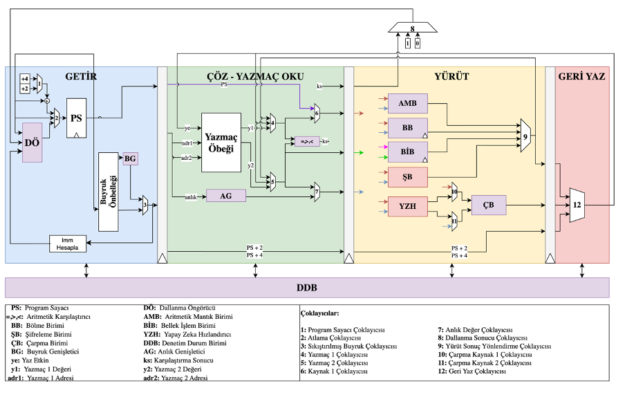

# tekno-kizil

## OPENLANE
Openlane github dosyalari: ``` tekno-kizil/openlane/kizil_islemci```<br>
Openlane Commiti: ```commit dc8e6bb151df7ee2b93d7e9d6a15abf6f224db4d (HEAD, tag: 2023.03.12)```


Openlane dosyaları zip: 
https://drive.google.com/drive/folders/1dEIMV9H3JBl-_G-wRf3G_0qm45DjGziY?usp=sharing

Alternatif link:
https://etuedutr-my.sharepoint.com/:f:/g/personal/seyyidhikmetcelik_etu_edu_tr/En43TU66Nl1Ji5QVRtBFXAcBxOaddUdlfn2X91mqJWlFJw?e=DJrjug
<br>


## KASIRGA - KIZIL Takımı Teknofest 2023 Yonga Tasarımı

KIZIL İşlemci Projesi

Danışman: Prof. Dr. Oğuz Ergin

Takım Kaptanı: Seyyid Hikmet Çelik

Emre Hakan Demirli

Mehmet Şakir Aslan

Ahmet Emre Oluk

Ege Deveci


## Sistem Yapısı

<p align="center">  </p>


## Çekirdek Yapısı

<p align="center">  </p>
